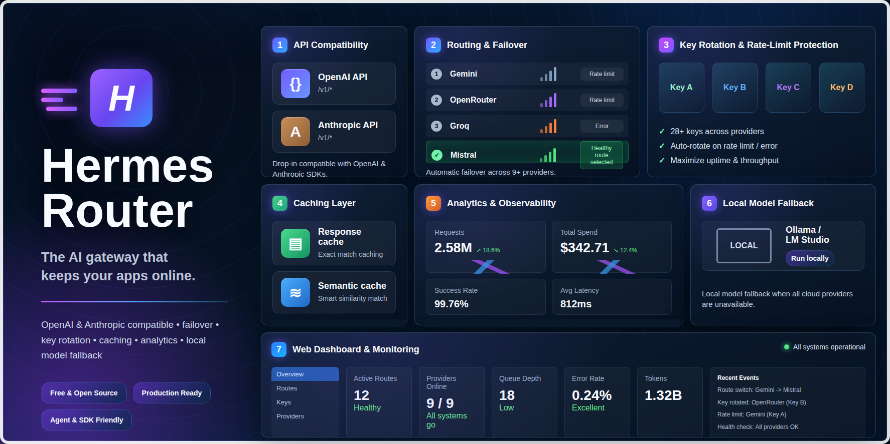

# hermes-router



**Keep your AI app online for free.** hermes-router sits between your app and a bunch of
free AI providers (Gemini, OpenRouter, Groq, and more). When one provider hits its rate
limit, it automatically tries the next one — so your app keeps working instead of erroring out.

It speaks the **OpenAI API**, so any tool or library that talks to OpenAI works with it
unchanged. You just point your app at hermes-router instead of at OpenAI.

---

## Who is this for?

- You're building something with AI and don't want to pay for an API yet.
- You keep hitting "rate limit exceeded" errors on free tiers.
- You have a few free API keys and want them used automatically, without writing
  switch-over logic yourself.

If that's you, this is a single Python file you run once and forget about.

---

## How it works (the 30-second version)

```
                    ┌─────────────────────────────────────────┐
   Your app  ─────► │             hermes-router               │
 (OpenAI SDK,       │                                         │
  curl, etc.)       │   Try Gemini      (key 1 → key 2 → …)  │
                    │   then OpenRouter (key 1 → key 2 → …)  │
                    │   then SambaNova                        │
                    │   then GitHub Models                    │
                    │   then Cerebras                         │
                    │   then Groq                             │
                    │   then Mistral                          │
                    │   then Cohere                           │
                    │   then Z.ai (GLM)                       │
                    └─────────────────────────────────────────┘
```

When a provider is rate-limited or exhausted, hermes-router moves down the list
automatically. The first one that answers wins. Your app never sees the failures.

**Extra niceties:**

- **Key rotation** — uses every key you give it for a provider before moving on.
- **Smart cooldowns** — a rate-limited key sits out for a while instead of being hammered.
- **Response cache** — repeated identical questions return instantly without spending quota.
- **Large-payload skip** — providers that reject big requests (like Groq's free tier) are
  skipped automatically when your prompt is too long, instead of wasting a failed attempt.
- **Thinking-field cleanup** — strips `reasoning_content` / `think` fields that some models
  add but others reject, which would otherwise cause errors when falling back.
- **Built-in monitoring** — see latency, error rates, and cache hits at `/v1/status`.

---

## What you'll need

1. **Python 3.10 or newer** — check with `python3 --version`.
2. **At least one free API key** from any provider in the table below. More is better —
   the whole point is to spread load across them.

---

## Quick start

```bash
# 1. Get the code
git clone https://github.com/Shaf2665/hermes-router
cd hermes-router

# 2. Install the two dependencies (Flask + requests)
pip install -r requirements.txt

# 3. Create your config file and add your API keys
cp .env.example .env
nano .env          # paste in at least one provider's key

# 4. Start it
python router.py
```

You'll see something like:

```
hermes-router starting on :8319
Providers: ['gemini', 'groq']
Cache: enabled (TTL=300s, max=100)
```

That's it — hermes-router is now listening on **http://localhost:8319**.

### Check that it's working

In another terminal:

```bash
curl http://localhost:8319/health
```

You should get back `{"status": "ok", "providers": [...]}`. If you see your providers
listed, you're ready to go.

---

## Getting free API keys

You only need one to start, but add as many as you can — that's what keeps you online.

| Provider | Free tier | Sign up |
|---|---|---|
| Gemini | Generous per-minute limits | [aistudio.google.com](https://aistudio.google.com) |
| OpenRouter | 50 requests/day per key | [openrouter.ai](https://openrouter.ai) |
| SambaNova | Free, fast Llama models | [cloud.sambanova.ai](https://cloud.sambanova.ai) |
| GitHub Models | Free with any GitHub account | [github.com/settings/tokens](https://github.com/settings/tokens) |
| Cerebras | Fast inference, free tier | [cloud.cerebras.ai](https://cloud.cerebras.ai) |
| Groq | Fast inference, free tier | [console.groq.com](https://console.groq.com) |
| Mistral | Free tier (mistral-small-latest) | [console.mistral.ai](https://console.mistral.ai) |
| Cohere | Free trial (1,000 calls/mo per key) | [dashboard.cohere.com](https://dashboard.cohere.com) |
| Z.ai (GLM) | Free (glm-4.5-flash, ~1k req/day) | [z.ai](https://z.ai) |

**Tip:** Most providers let you create more than one key, and you can sign up with
multiple Google / GitHub accounts to stack even more free quota. Add them all as
comma-separated values (see below).

---

## Using it from your app

Point any OpenAI client at `http://localhost:8319/v1` and use the model name
`hermes-router`. Use one of your `PROXY_API_KEYS` values as the API key.

**Python:**
```python
from openai import OpenAI

client = OpenAI(
    base_url="http://localhost:8319/v1",
    api_key="sk-router-1",          # one of your PROXY_API_KEYS
)

response = client.chat.completions.create(
    model="hermes-router",
    messages=[{"role": "user", "content": "Hello!"}],
)
print(response.choices[0].message.content)
```

**curl:**
```bash
curl http://localhost:8319/v1/chat/completions \
  -H "Authorization: Bearer sk-router-1" \
  -H "Content-Type: application/json" \
  -d '{
    "model": "hermes-router",
    "messages": [{"role": "user", "content": "Hello!"}]
  }'
```

Streaming (`"stream": true`) works too.

---

## Works with any agent framework

hermes-router speaks the OpenAI API, so it drops into any framework that supports a custom
`base_url` — no code changes beyond the two lines below.

**LangChain**
```python
from langchain_openai import ChatOpenAI

llm = ChatOpenAI(
    base_url="http://localhost:8319/v1",
    api_key="sk-router-1",
    model="hermes-router",
)
```

**LlamaIndex**
```python
from llama_index.llms.openai import OpenAI

llm = OpenAI(
    api_base="http://localhost:8319/v1",
    api_key="sk-router-1",
    model="hermes-router",
)
```

**CrewAI**
```python
from crewai import LLM

llm = LLM(
    model="openai/hermes-router",
    base_url="http://localhost:8319/v1",
    api_key="sk-router-1",
)
```

**AutoGen**
```python
config_list = [{
    "model": "hermes-router",
    "api_key": "sk-router-1",
    "base_url": "http://localhost:8319/v1",
}]
```

**Hermes Agent** (native)
```yaml
# config.yaml
custom_providers:
  - name: my-router
    base_url: http://localhost:8319/v1
    api_key_env: PROXY_API_KEY
model:
  default: custom:my-router
```

Any other framework with an `openai_api_base` / `base_url` setting works the same way.

---

## Configuration

Everything is set in the `.env` file (or as real environment variables). You only need
the keys for the providers you actually use — anything left blank is skipped automatically.

### API keys (add the ones you have)

| Variable | Description |
|---|---|
| `GEMINI_API_KEYS` | Gemini keys (see multi-key formats below) |
| `OPENROUTER_API_KEYS` | OpenRouter keys |
| `SAMBANOVA_API_KEY` | SambaNova key |
| `GITHUB_MODELS_TOKEN` | GitHub Models token |
| `CEREBRAS_API_KEY` | Cerebras key |
| `GROQ_API_KEY` | Groq key |
| `MISTRAL_API_KEY` | Mistral key |
| `COHERE_API_KEY` | Cohere key |
| `GLM_API_KEY` | Z.ai / GLM key |

**Three ways to give a provider multiple keys (all work, all combine automatically):**

```bash
# 1. Comma-separated (canonical)
GEMINI_API_KEYS=key1,key2,key3

# 2. Numbered suffixes
GROQ_API_KEY=key1
GROQ_API_KEY_2=key2
GROQ_API_KEY_3=key3

# 3. Mix both — they merge and de-duplicate
MISTRAL_API_KEY=key1
MISTRAL_API_KEY_2=key2
MISTRAL_API_KEYS=key3,key4
```

The router round-robins through all keys for a provider before cascading to the next one.

### Optional settings (sensible defaults — change only if you want to)

| Variable | What it does | Default |
|---|---|---|
| `PROXY_API_KEYS` | The key(s) your app uses to talk to hermes-router | `sk-router-1` |
| `PORT` | Port to listen on | `8319` |
| `LOG_LEVEL` | `DEBUG`, `INFO`, or `WARNING` | `INFO` |
| `GEMINI_MODEL` | Which Gemini model to use | `gemini-2.5-flash-lite` |
| `OPENROUTER_MODEL` | Which OpenRouter model to use | `nvidia/nemotron-3-super-120b-a12b:free` |
| `SAMBANOVA_MODEL` | Which SambaNova model to use | `Meta-Llama-3.3-70B-Instruct` |
| `GITHUB_MODELS_MODEL` | Which GitHub model to use | `gpt-4o-mini` |
| `CEREBRAS_MODEL` | Which Cerebras model to use | `gpt-oss-120b` |
| `GROQ_MODEL` | Which Groq model to use | `llama-3.1-8b-instant` |
| `MISTRAL_MODEL` | Which Mistral model to use | `mistral-small-latest` |
| `COHERE_MODEL` | Which Cohere model to use | `command-r7b-12-2024` |
| `ZAI_MODEL` | Which Z.ai (GLM) model to use | `glm-4.5-flash` |
| `ROUTER_MODEL_ID` | The model name your app sends | `hermes-router` |
| `CACHE_TTL_SECONDS` | Cache identical answers for N seconds (`0` = off) | `300` |
| `CACHE_MAX_SIZE` | How many answers to keep cached | `100` |
| `FAST_ROUTE_THRESHOLD` | Requests shorter than this (estimated tokens) prefer low-latency providers (Groq, Cerebras, SambaNova) when ratings tie (`0` = off) | `0` |
| `ROUTER_STATE_TTL_HOURS` | Reuse saved provider ratings for N hours instead of re-probing (and spending quota) on every restart (`0` = always re-probe) | `24` |
| `MAX_REQUEST_BYTES` | Largest request body accepted | `10485760` (10 MB) |
| `WORKER_THREADS` | Server worker threads | `16` |
| `GROQ_SKIP_TOKENS_OVER` | Skip Groq when a request is bigger than this (it would be rejected anyway). Set `0` to disable, or raise it if you're on a paid Groq tier. | `5500` |

> Any provider can have its own skip ceiling with `{PROVIDER}_SKIP_TOKENS_OVER`,
> e.g. `CEREBRAS_SKIP_TOKENS_OVER=30000`.

> **Note on the cache:** cached answers are shared across *all* clients of your
> router (every `PROXY_API_KEYS` holder). That's perfect for personal use, but if
> you expose one router to multiple untrusted users, set `CACHE_TTL_SECONDS=0` so
> one user can never receive a response cached from another.

---

## Running it 24/7 (Linux systemd service)

So it starts on boot and restarts if it ever crashes:

```bash
sudo nano /etc/systemd/system/hermes-router.service
```

```ini
[Unit]
Description=hermes-router AI load balancer
After=network.target

[Service]
ExecStart=/usr/bin/python3 /path/to/hermes-router/router.py
WorkingDirectory=/path/to/hermes-router
EnvironmentFile=/path/to/hermes-router/.env
Restart=always
RestartSec=5

[Install]
WantedBy=multi-user.target
```

```bash
sudo systemctl daemon-reload
sudo systemctl enable --now hermes-router
```

(Replace `/path/to/hermes-router` with the real folder path.)

---

## Running with Docker

```bash
cp .env.example .env
# fill in your keys
docker compose up -d
```

---

## API endpoints

| Endpoint | Needs auth? | What it's for |
|---|---|---|
| `GET /health` | No | Quick "is it up?" check — returns the provider list |
| `GET /v1/models` | Yes | Lists the model name your app should use |
| `POST /v1/chat/completions` | Yes | The main chat endpoint (streaming supported) |
| `GET /v1/status` | Yes | Live view of every key, provider stats, and cache metrics |

### Checking status

```bash
curl http://localhost:8319/v1/status \
  -H "Authorization: Bearer sk-router-1"
```

Example response:

```json
{
  "providers": {
    "gemini": {
      "keys": [
        {"key_tail": "abc123", "status": "ready",   "ready_in": 0},
        {"key_tail": "xyz789", "status": "cooling", "ready_in": 42}
      ],
      "stats": {"avg_latency_ms": 850, "error_rate": 0.0, "total_requests": 42}
    },
    "groq": {
      "keys": [{"key_tail": "def456", "status": "ready", "ready_in": 0}],
      "stats": {"avg_latency_ms": 210, "error_rate": 0.05, "total_requests": 18},
      "skip_if_tokens_over": 5500
    }
  },
  "cache": {"enabled": true, "ttl_s": 300, "size": 12, "max_size": 100,
            "hits": 8, "misses": 30, "hit_rate": 0.211},
  "fast_routing": {"enabled": false, "threshold_tokens": 0,
                   "fast_providers": ["cerebras", "groq", "sambanova"]}
}
```

- `status: ready` — key is good to use right now.
- `status: cooling` — key was rate-limited; `ready_in` is seconds until it's usable again.

---

## What happens on each request (the cascade)

```
Request received
  │
  ▼
Try Gemini key 1 ──429──► Try Gemini key 2 ──429──► All Gemini keys cooling
                                                              │
                                                              ▼
                                                    Try OpenRouter key 1 ──429──► …
                                                              │ (all exhausted)
                                                              ▼
                                                         Try Cerebras
                                                              │ (exhausted)
                                                              ▼
                                                           Try Groq
                                                              │ (exhausted)
                                                              ▼
                                                         Try Mistral
                                                              │ (exhausted)
                                                              ▼
                                                         Try Cohere
                                                              │ (exhausted)
                                                              ▼
                                                       Try Z.ai (GLM)
                                                              │ (exhausted)
                                                              ▼
                                                 503 — all providers exhausted
```

How different errors are handled:

- **429 (rate limited)** → that key cools down, try the next key for the same provider.
- **400 / 401 / 403** → skip the whole provider (bad key or unsupported request).
- **413 (too big)** → request too large for this provider, move to the next one.
- **5xx (provider error)** → brief cooldown, then retry.

---

## Troubleshooting

**`503 — all providers exhausted`**
All your keys are rate-limited or invalid. Check `/v1/status` — if everything shows
`cooling`, just wait, or add more keys. If a provider shows repeated errors, double-check
that key is valid.

**`401 unauthorized` from hermes-router itself**
The `Authorization` header your app sends must match one of your `PROXY_API_KEYS`. They're
two different things: provider keys go in `.env`; the key your *app* uses is `PROXY_API_KEYS`.

**A provider is always being skipped**
Check `/v1/status` for a `skip_if_tokens_over` value — your prompts may be larger than that
provider's limit. Raise the limit (e.g. `GROQ_SKIP_TOKENS_OVER=0` to disable) if you're on
a paid tier.

**Nothing happens / connection refused**
Make sure `python router.py` is still running and you're using the right port (default 8319).

---

## License

[MIT](LICENSE) — free to use, modify, and distribute.
